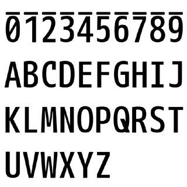

taimenFont
==========================

「対面電書」のパスワード用フォントです。

+ [対面電書](https://taimen.jp/)

「対面電書」は、同人イベント会場で対面ダウンロード販売を支援するための、シリアルとパスワードを生成するサービスです。このサービスの利用者は、ダウンロードURLとシリアルナンバー、パスワードを印刷した紙（カードなど）を、購入者に渡します。

このサービスのパスワードは、英数混じりの文字です。そして、視認するには難しい文字が含まれています。たとえば「0（ゼロ）」と「O（オー）」、「1（イチ）」と「I（アイ）」などです。

プログラム側でこれらの文字を省いておいてくれるとありがたいのですが、そうしたバージョンアップがなされる気配がないので、これらの文字を強制的に区別するための、TrueTypeフォントを作成しました。このフォントでは、数字に上線が入っています。

このフォントは、「M+ 1mn medium」の派生フォントです。「taimenFont」には、パスワードに必要な英数字のみが入っています。

+ [M+ FONTS](https://mplus-fonts.osdn.jp/)

## License

ライセンスは、「M+ FONTS」のライセンスに準じます。

> これらのフォントはフリー（自由な）ソフトウエアです。 
> あらゆる改変の有無に関わらず、また商業的な利用であっても、自由にご利用、複製、再配布することができますが、全て無保証とさせていただきます。

## Preview

収録されている英数字を表示したサンプルです。

## How to make

「Inkscape」を使ってSVGフォントを作成したあと、「Online font converter」を利用して、TrueTypeフォントにしています。

+ [Inkscape](https://inkscape.org/)
+ [Online font converter](http://www.fontconverter.org/)

以下、「Inkscape」（ver 0.48）での作業手順です。他のバージョンでも、大きく異なることはないと思います。備忘録のために、まとめておきます。

1. メニューの［テキスト］→［SVGフォントエディター］を選択して、「SVGフォントエディター」を開く。
2. ［新規］ボタンを押して、新しいフォントを作る。
3. ［全体設定］タブを開く。「ファミリ名」を設定する。「幅」はデフォルトの「1024」を採用する。
4. いったん「Inkscape」を終了する。SVGファイルを開き、以下の設定を変更する。
    + フォント名の変更：「&lt;font id="font-face3750"」を「&lt;font id="taimenFont"」に変える。
    + 等幅フォントの幅を変更：「&lt;font horiz-adv-x="1024"」を「&lt;font horiz-adv-x="512"」に変える。
5. SVGファイルを「Inkscape」で開き、メニューの［ファイル］→［ドキュメントの設定］で、カスタムサイズ「幅」「1024」px、「高さ」「512」pxを入力する。
6. 文字ごとのレイヤーを作り、文字のパスを配置していく。
    + 基準位置は以下のようにする。横方向の中央は、256pxの位置とする。下端は、550pxの位置とする。試行錯誤で、この位置が最もしっくりと来た。
    + 各文字のパスは、メニューの［パス］→［統合］を利用して、単一状態にする。
7. 「SVGフォントエディター」の［グリフ］タブを開き、［グリフを追加］ボタンでグリフを追加する。
8. グリフは「グリフ名」と「マッチング文字列」がセットになっている。「マッチング文字列」は空なので、英数字を設定していく。（例：グリフ名「グリフ1」、マッチング文字列「a」）
9. グリフを選択した状態で、単一状態になっている文字のパスを選択して、「選択オブジェクトから曲線を取得」ボタンを押す。この操作で、「マッチング文字列」とパスが関連づけられる。
    + パスを移動した際は、再度ボタンを押す必要がある。
    + 2～3文字作成したあと、「Online font converter」を利用してTrueTypeフォントにして、位置などを確かめておいた方がよい。
10. 全ての文字を設定し終えたら、「Online font converter」を利用してTrueTypeフォントにする。

上記手順は、それなりに面倒です。英数字のみのフォントを、無料で手軽に作る程度にしか使えません。プログラムを書いて自動化するか、専用のソフトを使う方が、おそらく簡単です。

## その他

作者は小説も書いています。文藝春秋から「ハッカー探偵 鹿敷堂桂馬」シリーズとして出ています。プログラマーが探偵役として活躍する小説なので、是非読んで下さい。

+ [裏切りのプログラム　ハッカー探偵 鹿敷堂桂馬](http://crocro.com/novel/item/uragiri-no-program/)
+ [顔貌売人　ハッカー探偵 鹿敷堂桂馬](http://crocro.com/novel/item/gannbou-baininn/)

